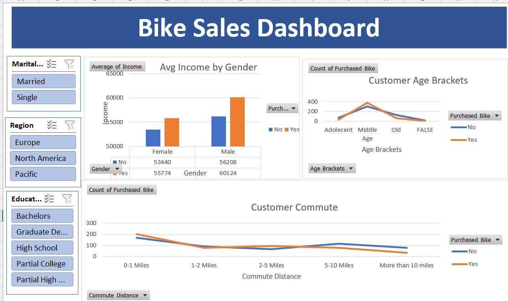
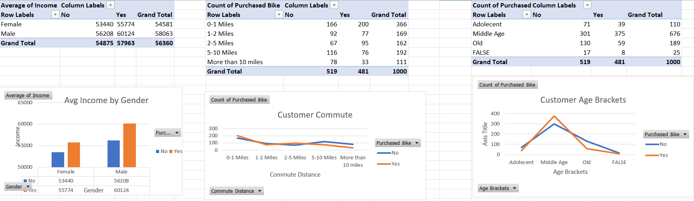

# Bike Buyers Data Analysis & Dashboard

## Project Overview
This project focuses on analyzing bike buyer data using Microsoft Excel. The objective is to explore customer characteristics, identify purchasing patterns, and present meaningful insights through Pivot Tables and an interactive dashboard.

The project demonstrates practical skills in data cleaning, data preparation, analysis, and visualization using Excel.

## Tools & Technologies
- Microsoft Excel
- Data Cleaning
- Excel Formulas
- Pivot Tables
- Data Analysis
- Data Visualization
- Dashboard Creation

## Dataset Description

The dataset contains 1,026 customer records and includes information about:

- Customer ID
- Marital Status
- Gender
- Income
- Number of Children
- Education
- Occupation
- Home Ownership
- Number of Cars
- Commute Distance
- Region
- Age
- Purchased Bike

## Project Workflow
1. Data Preparation

Organized and prepared the raw bike buyers dataset for analysis.

2. Data Cleaning and Working Sheet

Created a working sheet to prepare the data and added an Age Brackets column to categorize customers by age.

3. Pivot Table Analysis

Created Pivot Tables to summarize customer data and explore relationships between customer characteristics and bike purchases.

4. Dashboard Development

Designed an Excel dashboard with charts and visual summaries to present bike purchasing patterns in an easy-to-understand format.

## Analysis Areas

The project explores bike purchasing behavior based on:

- Gender
- Age and Age Brackets
- Income
- Education
- Occupation
- Region
- Commute Distance
- Number of Cars
- Marital Status
- Home Ownership
- Number of Children

## Project Files
| File | Description |
|---|---|
| `Bike_Buyers_Data_Analysis.xlsx` | Complete Excel workbook |
| `Dashboard.png` | Dashboard screenshot |
| `Pivot_table.png` | Pivot Table screenshot |
| `README.md` | Project documentation |

## Excel Workbook Sheets

The workbook includes:

- bike_buyers — Original dataset
- Working Sheet — Prepared data with Age Brackets
- Pivot table — Summary analysis
- Dashboard — Visual presentation of insights

## Dashboard Preview

## Pivot Table Analysis

## Project Objective

To transform raw customer data into meaningful insights using Excel data analysis techniques and dashboard visualizations.

## Author

Shruti Ajit Khurpe
